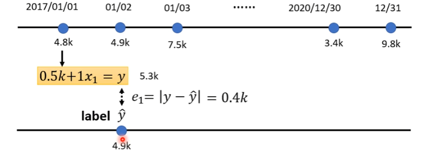
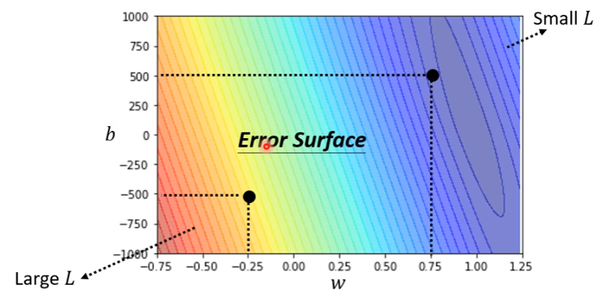

# Machine learning $\approx$ Looking for Function
- Speech Recognition
- Image Recognition 
- Alpha Go

# Different types of Functions
1. **Regression**: The function outputs a scaler.
	- *Predict PM2.5*
2. **Classification**: Given options (**classes**), the function outputs the correct one.
	- *SPAM filtering*
	- Playing Go
3. **Structured Learning**: Create something with structure (Image, Document)

# How to find out the function

### 1. Function with Unknown Parameters

> $y = f(input)$

> *Model*: $y = b + wx_1$
> $b$: bias  $w$: weight

### 2. Define Loss from Training Data

#### Loss is a function of parameters: $L(b,w)$

- **Loss: reflect how good a set of values is.**

- #### **Calculate all the $e_n$, and $L = \frac{1}{N} \mathop{\sum}\limits_{n} e_n$**
	- $e=|y-\hat{y}|$ L is mean [^1] absolute error (MAE)
	- $e=(y-\hat{y})^2$ L is mean [^1] square error (MSE) 

- #### By calculate all the Loss, we can draw a graph named Error Surface

	*Error Surface be like:*

### 3. Optimization[^2] 

> $w^{\star},b^{\star} = \mathop{\arg\min}\limits_{w,b} L$

#### 1. Only One Parameter *be like*

**Gradient Descent**: the way we use for Optimization.
1. (Randomly) Pick an initial value $w^0$.
2. Compute $\frac{\partial L}{\partial w}|_{w=w^0}$.
3. Change $w^0$ to $w^1$.
	- If $\frac{\partial L}{\partial w}|_{w=w^0} > 0$, $w^1 < w^0$ 
	- If $\frac{\partial L}{\partial w}|_{w=w^0} < 0$, $w^1 > w^0$ 
	- $|w^0 - w^1| = \eta \cdot\frac{\partial L}{\partial w}|_{w=w^0}$
		- Learning Rate $\eta$：hyperparameters[^3].
4. Update $w$ iteratively.
	- Local minima
	- Global minima

Gradient Descent May Lead to <i>Local Minima</i>!!!
 

#### 2. Two Parameters

1. (Randomly) Pick initial values $w^0,b^0$.
2. Compute $\frac{\partial L}{\partial w}|_{w=w^0,b-b^0}$, $\frac{\partial L}{\partial b}|_{w=w^0,b-b^0}$.
3. Update $w$ and $b$ iteratively.

---

> <i># Attention:</i>
> 
> 1. **All the formulas above are Linear Model!**
>
> 2. All the step above is **Training**.
> 
> 3. **Introduce exceed arguments into function will lead to overfit, and generate meaningless answer!**

[^1]: mean: adj. 平均的
[^2]: optimization: n. 最佳化，优化
[^3]: hyperparameter: n. 超参数，在机器学习中需要自己自己设定的参数