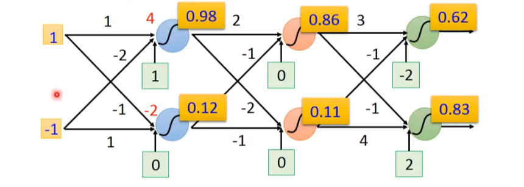

# Ups and downs of Deep Learning
- 1958: Perceptron (linear model)
- 1969: Perceptron has limitation
- 1980s: Multi-layer perceptron
	- Do not have signficant difference from DNN today
- 1986: Backpropagation
	- Usually more than 3 hidden layers is not helpful
- 1989: 1 hidden layer is "good enough", why deep?
- 2006: RBM initialization (breakthrough)
- 2009: GPU
- 2011: Start to be popular in speech recognition
- 2012: Win ILSVRC image competition

# Three Steps for Deep Learning

1. define a set of function
2. goodness of function
3. the best function

# Neural Network

## Fully Connect Feedforward Network

*Deep = Many Layers*

# Matrix Opearation

$$\begin{bmatrix}1 & -2 \\ -1 & 1\end{bmatrix}\begin{bmatrix}1 \\ -1\end{bmatrix} + \begin{bmatrix}1 \\ 0\end{bmatrix} = \begin{bmatrix}4 \\ -2\end{bmatrix} \quad (\mathbf{W} \mathbf{x} + \mathbf{b} = \mathbf{y})$$
$$\sigma (\begin{bmatrix}4 \\ -2\end{bmatrix}) = \begin{bmatrix}0.98 \\ 0.12\end{bmatrix}$$

> But now, we seldomly use Sigmoid Function.

> So, Neural NEtwork is a set of matrix computions.

## Output Layer

# Loss Function

## Total Loss

## The way to reduce Total Loss: Gradient Descent

We can use Backpropagation to compute the partial differential for each parameter.