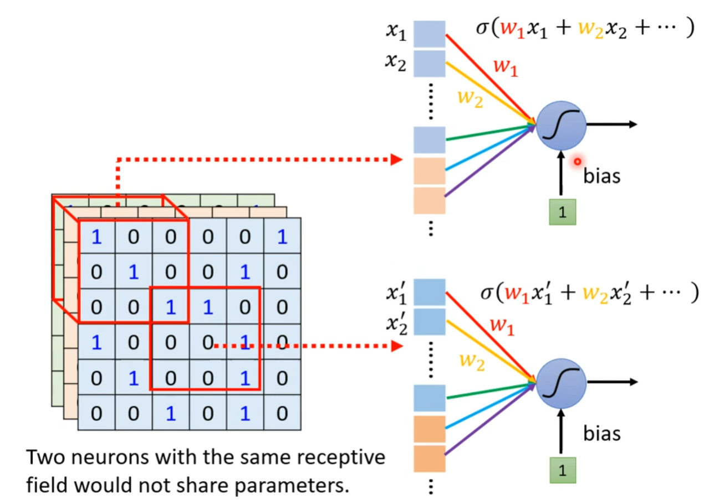
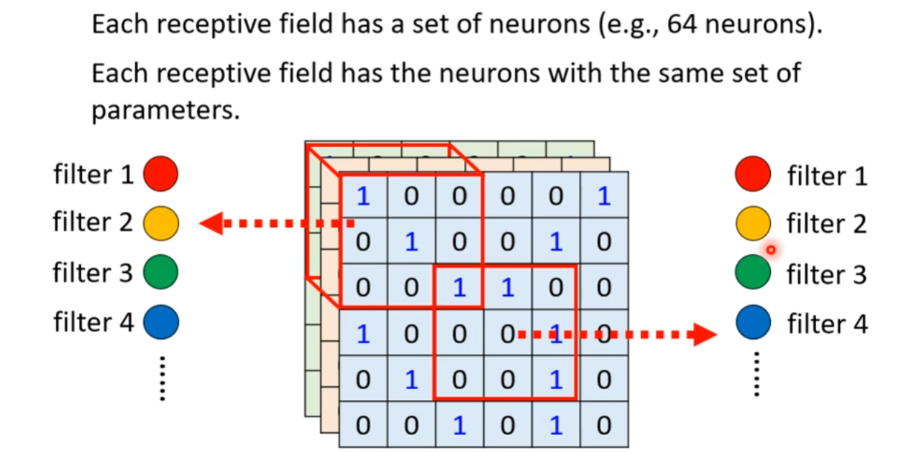

*CNN is used as image classificator.*

# Preprocess

*But how we as human recognise the objects in a photo?*

We normally recognise the specific pattern of the objects to reach the answer.

# Simplification

## Receptive field

1. *Receptive fields can overlap each other with a sharing part.*
2. *Recetive fields can be any shape but most square.*

> Typical Setting of Receptive Field:
> 1. To see all the channels
> 2. Kernal size is normally 3x3
> 3. Stride is normally less than 3
> 4. If the receptive field goes out of the image, you need to do padding, such as zero or meanings. It's up to you.

## Parameter Sharing

*The same pattern may appear in different area of the image.*

So we can let two neurons sharing the same parameter.

> Typical Setting of Parameter Sharing:
> 

# Summary

# Additional

## Pooling

We can use the way named Pooling to reduce the volume of computation.

1. Max Pooling
2. Mean Pooling

Also, this way is named after Subsampling.

## Data Augmentation

We can rotato the direction of image and zoom in and out of the image to improve the goodness of the result.