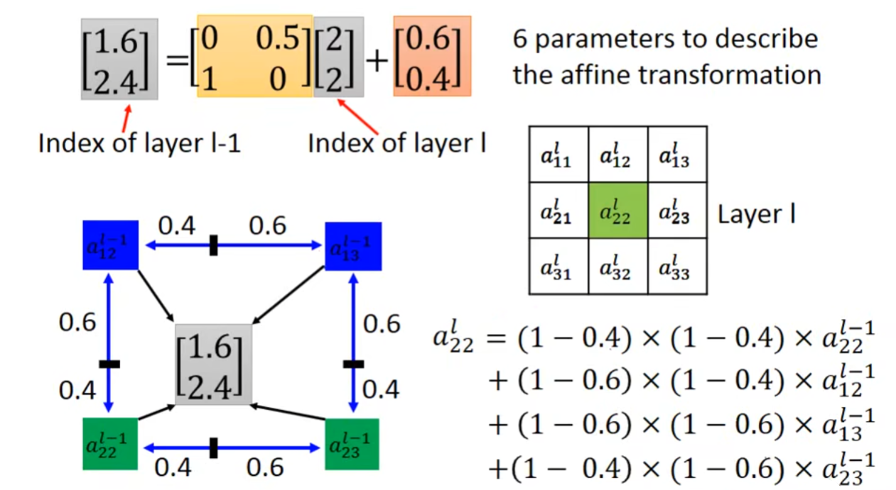

# Spatial Transformer Layer

*CNN is not invariant to scaling and rotation.*

## How to tansform an image/feature map

### Scaling

Enlarge the image by two times:
$$\begin{bmatrix}x' \\ y'\end{bmatrix} = \begin{bmatrix}2 & 0 \\ 0 & 2\end{bmatrix}\begin{bmatrix}x \\ y \end{bmatrix} + \begin{bmatrix}0 \\ 0\end{bmatrix}$$

### Rotation

Rotate $\theta^{\circ}$:
$$\begin{bmatrix}x^{\prime}\\y^{\prime}\end{bmatrix}=\begin{bmatrix}cos\theta&-sin\theta\\sin\theta&cos\theta\end{bmatrix}\begin{bmatrix}x\\y\end{bmatrix}+\begin{bmatrix}0\\0\end{bmatrix}$$

But this neural network cannot use gradient decsent, because the gradient is always zero.

## Interpolation

