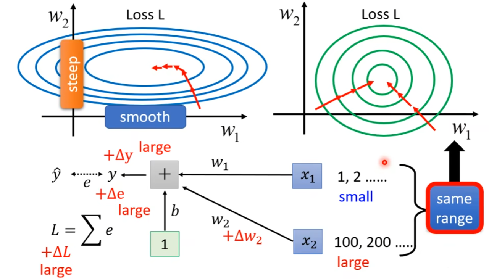
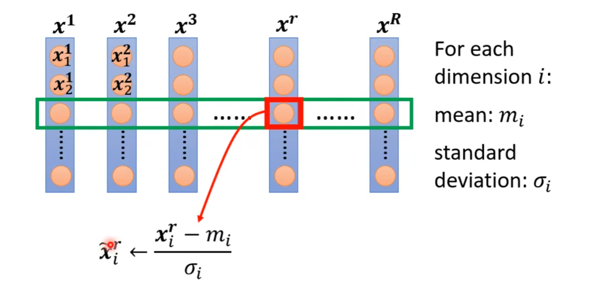
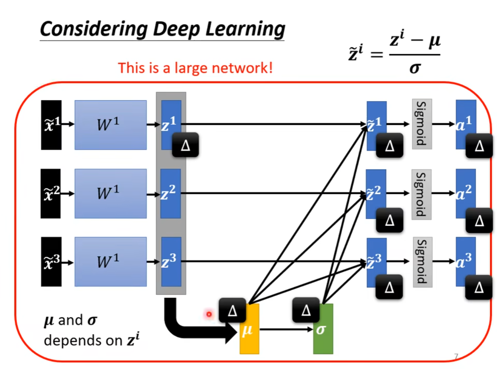
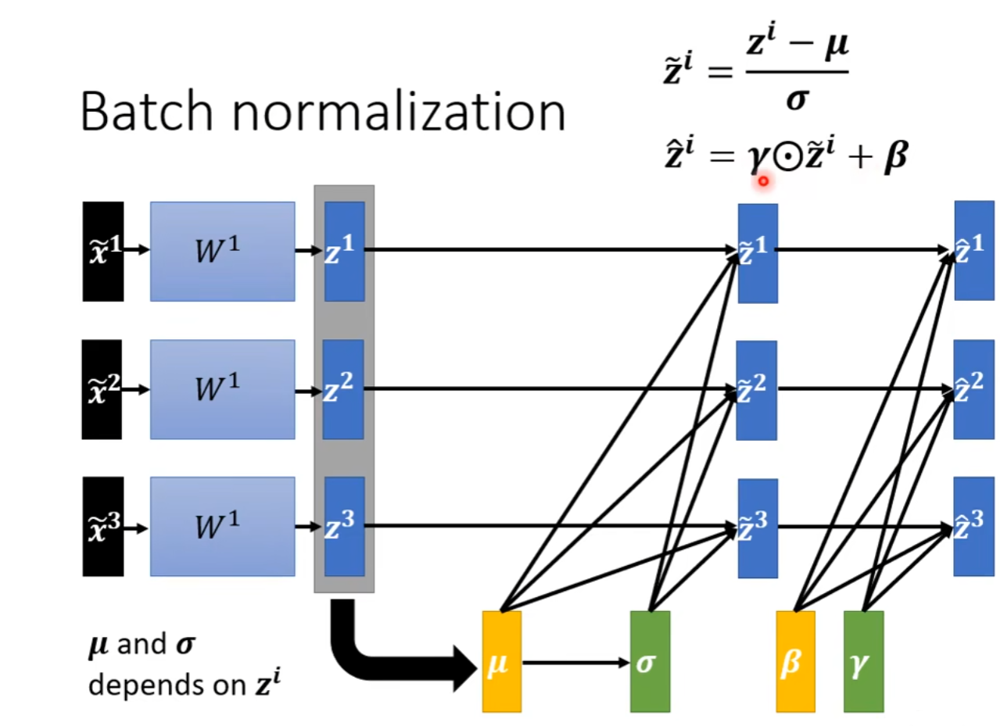

# Changing Landscape

*由于输入数值的范围的影响，计算出来的$w$可能会很大，使得训练不好做，所以我们可以通过改变输入数值的范围来改变计算出来的$w$的大小。*

# Feature Normalization

*这个方法叫做 Standardization ,通过这种方法使所有的维度的平均值是0，所有的值都在0和1之间。*

*但是，我们的显存没办法计算几百万数据的值，所以我们需要规划一个 Batch 并在里面进行 Normalization 。*

*但是，我们可能需要让 $z$ 拥有更大的范围，所以我们设计一个 $\beta$ 和 $\gamma$ 来让计算机自己通过学习来决定 $z$ 的范围， $\beta$ 和 $\gamma$ 初始化成全是1和0的向量*

PyTorch 会通过计算每一个输入的数据的滚动平均值。

# The way to normalization 

1. Batch Renormalization
2. Layer Normalization
3. Instance Normalizatiob
4. Group Normalization
5. Weight Normalization
6. Spectrum Normalizatioin