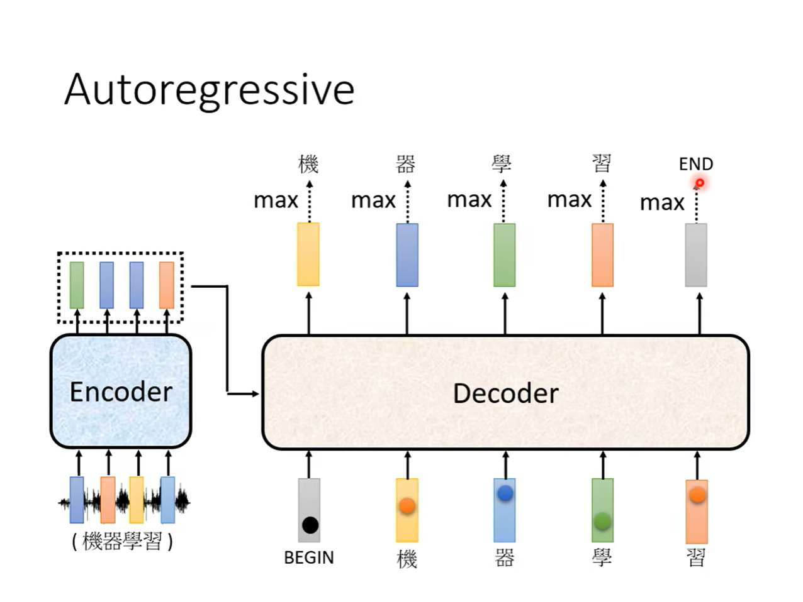

*Transformer is a type of Sequence-to-Sequence model.* Normally, the input is not as same length as the output.

For example:

1. Speech Recognition
2. Speech Translation
3. Machine Translation
4. Object Detection

## Main Process

# Encoder

In Transformer, the encoder part is self-attention.

# Decoder

***Autoregressive** is a type of decoder.*

## Masked Multi-Head Attention

## Stop at END

# Non-autoregressive

The way to decide the length of the output:

- We can use another Classifer to predict the length of the output or set a limitation of the output, give a series of BEGIN and get the word before the END as output.

The advantage of NAT:

- parallel, controllable output length

But NAT is usually worse than AT.

# Training

**Teacher forcing**: Input the right answer to Decoder directly. But when Tesing, there is obviously no the right answer given to Decoder to see, so there may be mismatch when training.

# Tips for Training

## Copy Mechanism

*Teach the model the ability to copy the token from the input as the output.*

> For example:
> **Chat-bot**:
> 	User: Hello, I'm *Cloro*.
> 	Machine: How are you, *Cloro*. Nice to meet you.
> **Sumarization**:
> 	Get the main details from the article. (The model need many materials for training)

Having the ability to copy the content from the original input is named after "Pointer Network".

## Guided Attention

Sometimes, there will occur the wrong result that we don't know the reason while training.

Guided Attention is to let us lead the process of attention.

The way to solve the problem:
1. Monotonic Attention
2. Location-aware attention

## Beam Search

*Assume there are only two tokens in the world.*

But beam search is useful or useless sometimes.

**When you need some creativity, you'd better don't use beam search.**

# Optimizing Evaluation Metrics?

**BLEU Score**: Compare two complete sentences to compute the score.

# Exposure bias

Chain reaction due to wrong outputs from Decoder as inputs.

To solve this, we need to put some wrong data in the ground truth. And this measure is named after Scheduled Sampling.