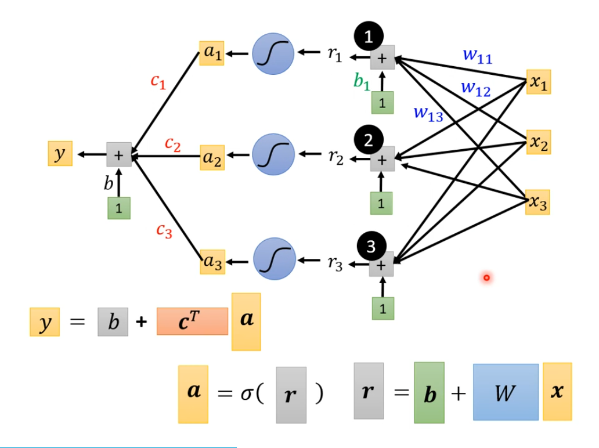
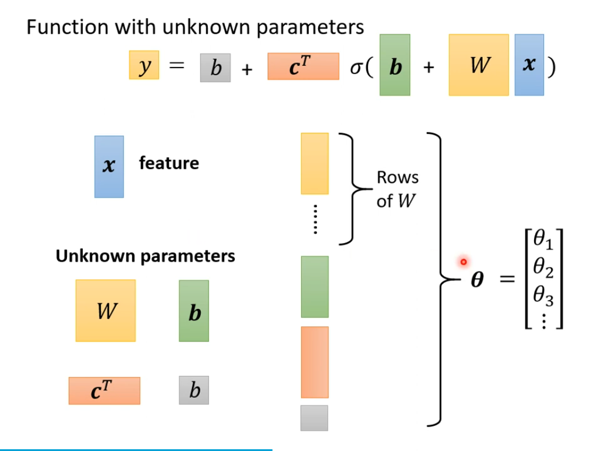
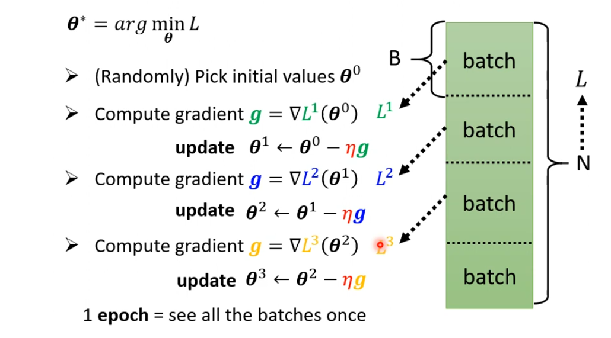
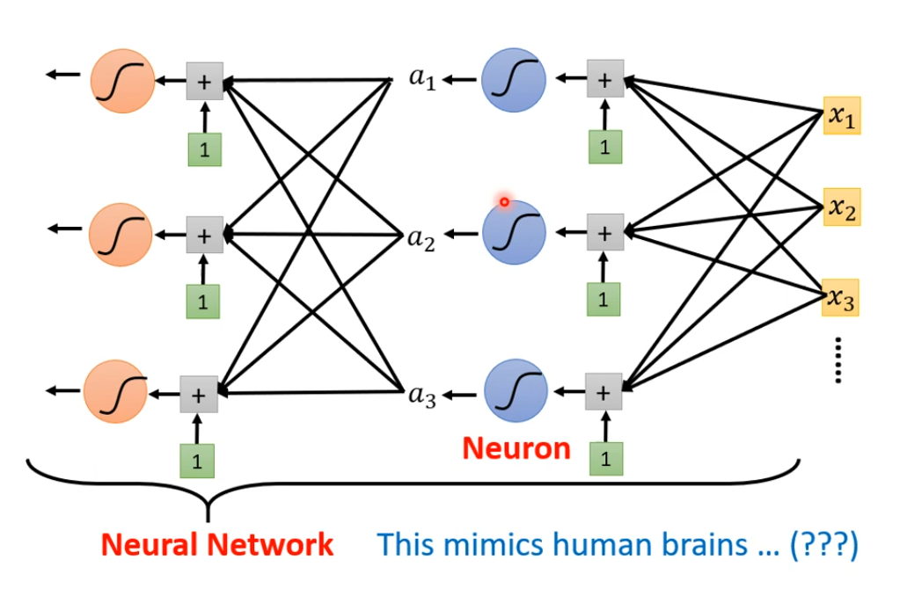

## 1. Linear Model Bias and Its Solution

Linear models are too simple... We need more *sophisticated* modes.

Linear models have severe limitation.

So we need a more complicated, resilient and with-more-argument function:

> **Piecewise Linear Curves** = Constant + a set of *Hard Sigmoid* Functions
> 
> *Sigmoid* Function: $$y = c \cdot \frac{1}{1+e^{-(b+wx_1)}} = c \cdot sigmoid(b+wx_1)$$

So for most types of functions, we can explain it by $$y = b + \mathop{\sum}\limits_{i}c_i \cdot sigmoid(b_i+w_ix_i)$$

And also, we can use more arguments to improve the sophistication of the function to reflect the relativity of different data: $$y = b + \mathop{\sum}\limits_{i}c_i \cdot sigmoid(b_i+\mathop{\sum}\limits_{j}w_{ij}x_j)$$
If we define: $$\mathbf{r} = \mathbf{b} + \mathbf{W} \mathbf{x}$$
Therefore, we can have:$$\mathbf{a_i} = sigmoid(\mathbf{r_i}) = \frac{1}{1+e^{\mathbf{-r_i}}}, \quad or \quad \mathbf{a} = \sigma (\mathbf{r})$$

> *# Define:*
> 
> $x$ : feature
> 
> $W, \mathbf{b}, \mathbf{c^T}, b$ : Unknown parameters $\theta$

## 2. Define Loss

Loss is a function of parameters $L(\theta)$, as it is done with the single $w, b$.

## 3. Optimization of New Model

Optimization: $\mathbf{\theta}^{\star} = arg \ \mathop{min}\limits_{\mathbf{\theta}} \ L$.

1. (Randomly) Pick initial values $\mathbf{\theta}^0$
2. Compute $\mathbf{g} = \begin{bmatrix} \frac{\partial L}{\partial \theta_1} | _{\mathbf{\theta} = \mathbf{\theta^0}} \\ \frac{\partial L}{\partial \theta_2} | _{\mathbf{\theta} = \mathbf{\theta^0}} \\ \vdots \end{bmatrix}$ ($g$ : **gradient**)
	- Also, $\mathbf{g} = \nabla L (\mathbf{\theta^0})$
3. Update parameter iteratively $\begin{bmatrix} \theta^1_1 \\ \theta^1_2 \\ \vdots \end{bmatrix} = \begin{bmatrix} \theta^0_1 \\ \theta^0_2 \\ \vdots \end{bmatrix} - \begin{bmatrix} \eta \frac{\partial L}{\partial \theta_1} | _{\mathbf{\theta} = \mathbf{\theta^0}} \\ \eta \frac{\partial L}{\partial \theta_2} | _{\mathbf{\theta} = \mathbf{\theta^0}} \\ \vdots \end{bmatrix}$
	- Also, $\mathbf{\theta^1} = \mathbf{\theta^0} - \eta \mathbf{g}$
4. To improve the speed of **Gradient Descend**, we may separate numerous data into some smaller *batches*, and we will compute each batch's **Loss**.
	

## 4. More Choices

### 1. Different Model

> *Rectified Linear Unit (ReLU):* $$y=c \ \max{(0,b+wx_1)}$$

> *# Attetion:*
> 1. Sigmoid and ReLU are both *Activation functions*.
> 2. ReLU has better performance than Sigmoid.

### 2. Multiple use of activation functions

$$\mathbf{a'} = \sigma (\mathbf{b'} + \mathbf{W'a}), \ \mathbf{a} = \sigma(\mathbf{b} + \mathbf{Wx})$$

## 5. A Fancy Name

1. All the single model is named as **Neuron**(hidden layer).
2. The whole multi-layer model is named as **Neural Network**(deep).
3. So the process of the Neural Network running is named as **Deep Learning**.

## 6. Deep = More and More Hidden Layer...

More and more hidden layer will bring better effects on the training data.

## 7. Overfitting

Better on train data, Worse on unseen data...