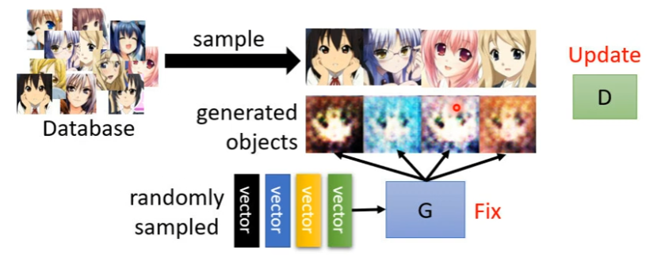

# Network as Generator

让Network接受两个值，一个是固定的输入x，一个是由一个简单的函数Sample出来的一个随机的分布。这样子就会产生一个复杂的输出分布y。

这样可以输出一个分布的Network就是Generator。

# Why distribution？

## Video Prediction

可以将先前的每一帧的数据作为输入输入到一个网络中，然后让他产生下一帧的输出。但是这样子做出的来的模型并不符合实际的需求，会产生很多奇怪的结果。

所以我们需要想输入中加入一个分布，使输出的结果也是一个概率分布。

**当我们的任务需要一点创造力的时候就可以使用这种方法。**

1. Drawing
2. Chatbot

# Generative Adversarial Network (GAN)

## Anime Face Generation

### Unconditional generation

#### Generator

#### Discriminator

这个神经网络用于评价 Generator 产生的结果，使用一个概率来表示结果的成功度。

## Basic Idea of GAN

## Algorithm

- Initialize generator and discriminator
- In each training iteration:
	1. Fix generator G, and update discriminator D
		
		Discriminator learns to assign high scores to real objects and low scores to generated objects.
	2. Fix discriminator D, and update generator G
		Generator learns to "fool" the discriminator
		
	3. Repeat the steps above
		

*Progressive GAN：可以产生非常逼真的人脸*

