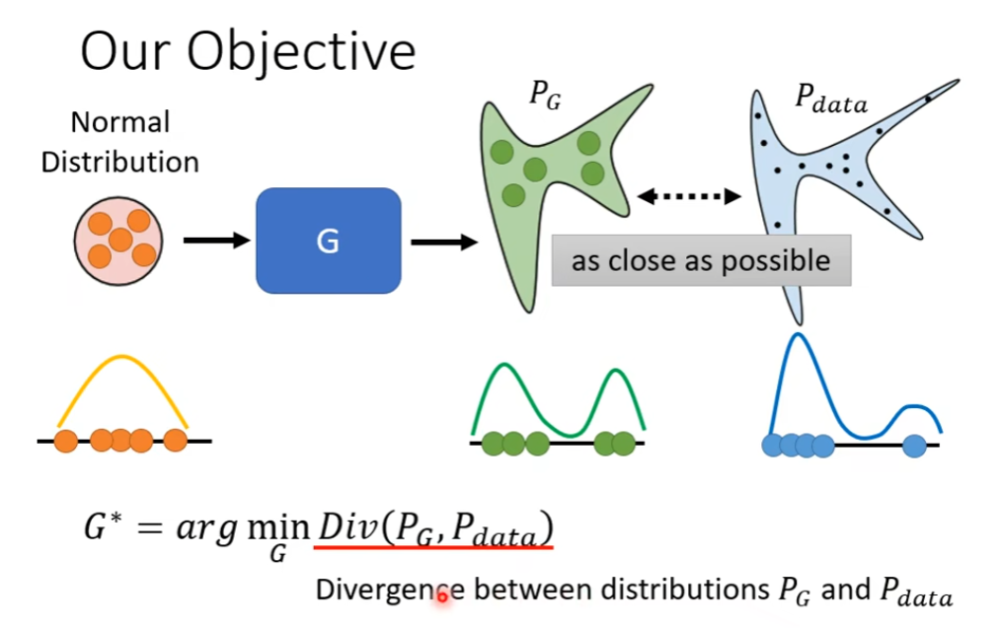
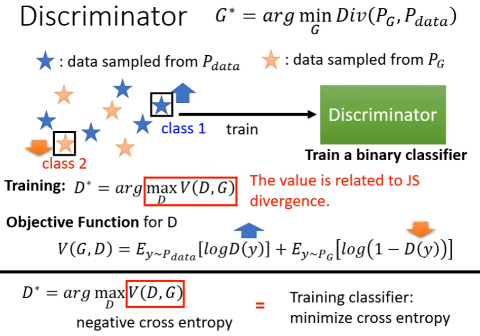
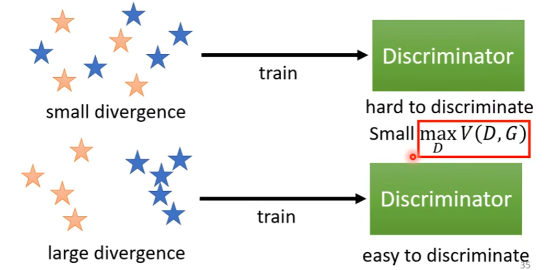
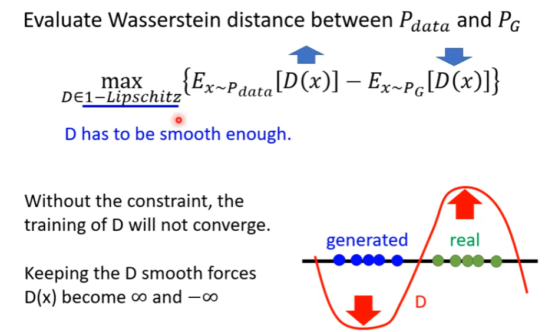
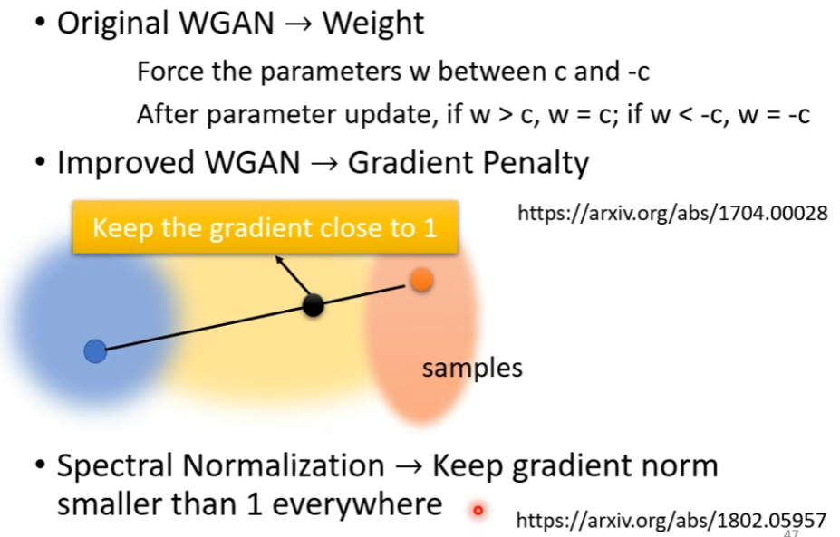

# Theory behind GAN

So, we need to choose a suitable divergence to improve the effect of training.

# Tips for training

##  JS divergence is not suitable

In most cases, $P_G$ and $P_{data}$ are not overlapped
1. The nature of data
	Both $P_G$ and $P_{data}$ are low-dim manifold in high-dim space.
	The overlap can be ignored.
2. Sampling
	Even though $P_G$ and $P_{data}$ have overlap.
	If you do not have enough sampling ..

If $P_G$ and $P_{data}$ have no overlap, the $JS(P_{G_0}, P_{data})=log2$ forever.

So we cannot use JS divergence for training.

## Wasserstein Distance

The smallest distance we make $P_G$ to $P_{data}$.

