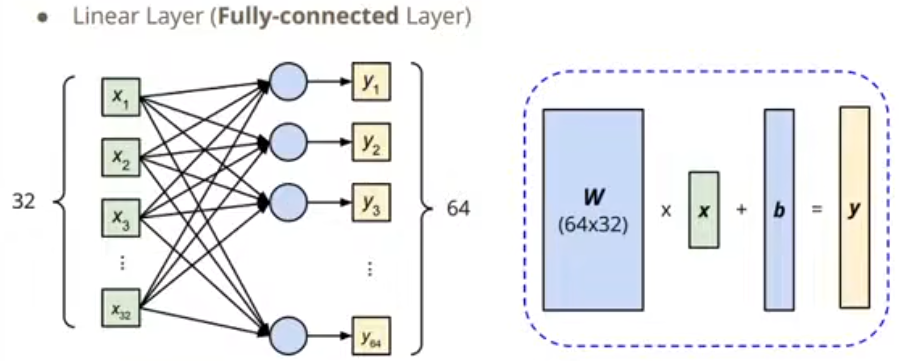

# Prerequisites
1. Python3
	- if-else, loop, function, file IO, class, ...
2. Deep Learning Basics
3. NumPy

# What is PyTorch?
- An **machine learning framework** in Python.
- Two main features:
	- N-dimensional **Tensor** computation (like NumPy) on **GPUs**
	- **Automatic differentiation** for training deep neural networks

# Data Load
1. `torch.utils.data.Dataset` & `torch.utils.data.DataLoader`
	- Dataset: stores data samples and expected values
	- Dataloader: groups data in batches, enables multiprocessing

> Example:
> ```
> dataset = MyDataSet(file)
> dataloader = DataLoader(dataset, batch_size, shffle = True)
> 			# Training: True, Testing: False  ^
> ```

2. Import data set

```
from torch.utils.data import Dataset, DataLoader

class MyDataSet(Dataset):
	def __init__(self, file):
		self.data = ...
	def __getitem__(self, index):
		return self.data[index]

	def __len__(self):
		return len(self.data)
```

3. Some basic functions

- dimension of data

	`data.shape()` : To get the dimension of a data set

- create of tensors

	`torch.tensor(list)` : To create a tensor from list

	`torch.from_numpy(np.array(list))` : To create a tensor form NumPy

	`torch.zeros(shape)` : To create a tensor filled with 0

	`torch.ones(shape)` : To create a tensor filled with 1

- basic calculation

	`tensor.sum()` : Summation

	`tensor.mean()` : Mean

	`tensor.pow(2)` : Power[^1]

- tensor calculation

	`tensor.transpose(dim0, dim1)` : transpose two specified dimensions

	`tensor.squeeze(dim)` : remove a specified dimension
	
	`tensor.unsqueeze(dim)` : add a specified dimension

	`tensor.cat([tensor1, ...], dim=0)` : alone with dimension 0 to concatenate tensors

4. Switch devices

`tensor.to('cpu')` : move tensor to CPU

`tensor.to('cuda')` : move tensor to GPU

`torch.cuda.is_available()` : test GPU is available or not

5. Gradient Calculation

```
>>> import torch as pt
>>> x = pt.tensor([[1.,0.],[-1.,1.]], requires_grad=True)
>>> z = x.pow(2).sum()
>>> z
tensor(3., grad_fn=<SumBackward0>)
>>> z.backward() # 反向传播法计算梯度
>>> z
tensor(3., grad_fn=<SumBackward0>)
>>> x.grad # 获得梯度
tensor([[ 2.,  0.],
        [-2.,  2.]])
```

# Define Neural Network

## torch.nn - Network Layers

`nn.Linear(in_features, out_features)` :

For example, nn.Linear(32, 64) means:



```
Python 3.9.21 (main, Dec 11 2024, 16:35:24) [MSC v.1929 64 bit (AMD64)] on win32
Type "help", "copyright", "credits" or "license" for more information.
>>> import torch
>>> layer = torch.nn.Linear(32,64)
>>> layer.weight.shape
torch.Size([64, 32])
>>> layer.bias.shape
torch.Size([64])
```

## Define a Network
```
import torch.nn as nn

class MyModel(nn.Module):
    def __init__(self):
        super(MyModel, self).__init__()
        self.net = nn.Sequential(
            nn.Linear(10, 32),
            nn.Sigmoid(),
            nn.Linear(32, 1),
        )
        
    def forward(self, x):
        return self.net(x)
```

# Loss Function

## Loss functions in torch.nn 

1. Mean Squared Error (for regression tasks)
	- `criterion = nn.MSELoss()`
2. Cross Entropy (for classification tasks)
	- `criterion = nn.CrossEntropyLos()`
3. `loss = criterion(model_output, expected_value)`

# Optimization Algorithm

## Optimization Algorithm in torch.optim

For example. Stochastic Gradient Descent (SGD)
	- `optimizer = torch.optim.SGD(model.parameters() ,lr, momentum = 0)`

## For every batch of data:
1. Call optimizer.zero_grad() to reset gradients of model parameters.
2. Call loss.backward() to back propagate gradients of prediction loss.
3. Call optimizer.step() to adjust model parameters.

# Entire Steps

## Setup

```
dataset = MyDataset(file)
tr_set = DataLoader(dataset, 16, shuffle = True)
model = MyModel().to(device）
criterion = nn.MSELoss()
optimizer = torch.optin.SCD(model.parameters(),0.1）
```

## Training Loooop

```
for epoch in range(n_epochs）: # loop count
		model.train() # set model to train mode
	for x, y in tr_set: # iterate through the dataloader
		optimizer.zero_grad()
		x, y = x.to(device), y.to(device)
		pred = model(x) # predict
		loss = criterion(pred, y)
		loss.backward()
		optimizer.step()
```

## Validation Loooop

```
model.eval() # set model to evaluation mode
total_loss=0
for x, y in dv_set:
	x, y=x.to(device), y.to(device)
	with torch.no_grad(): # disable gradient calculation
		pred = model(x)
		loss = criterion(pred, y)
	total_loss += loss.cpu().item()*len(x)
	avg_loss = total_loss / len(dv_set.dataset)
```

## Testing loooop

```
model.eval()
preds = []
for x in tt_set:
	x = x.to(device)
	with torch.no_grad():
		pred = model(x)
		preds.append(pred.cpu())
```

## Why we need to do so?

- model.eval()
	Changes behavior of some model layers, such as dropout and batch normalization.
- with torch.no_grad()
	Prevents calculations from being added into gradient computation graph. Usually used to prevent accidental training on validation/testing data.

# Save / Load Trained Models

1. Save
	- `torch.save(model.state_dict(), path)`
2. Load
	- `ckpt = torch.load(path)`
	- `model.load_state_dict(ckpt)`
[^1]: power v. 幂运算
[^2]: transpose v. 转置运算