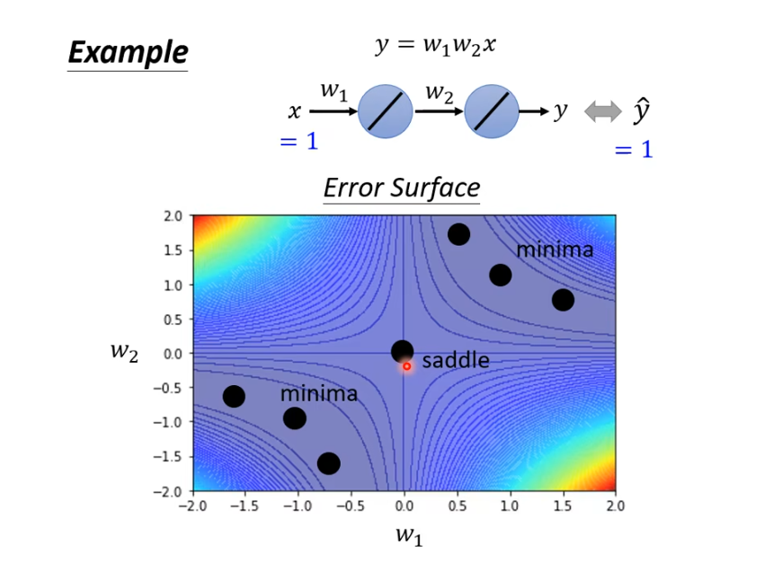
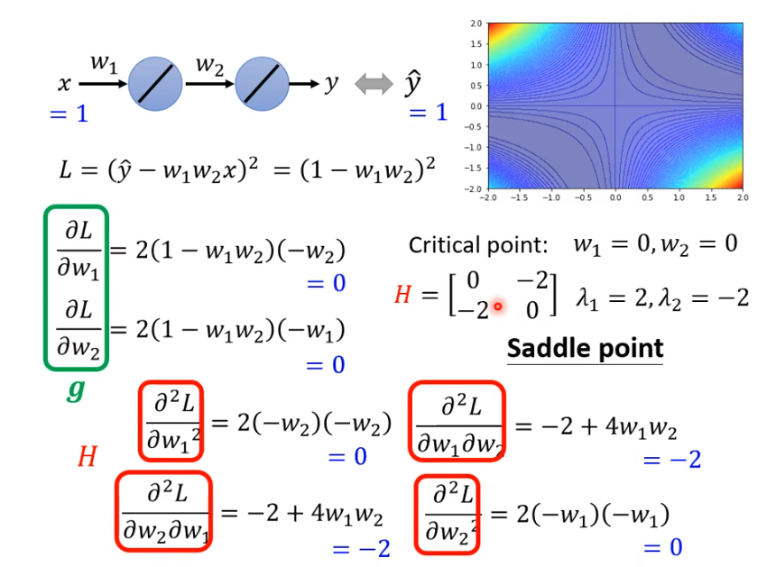
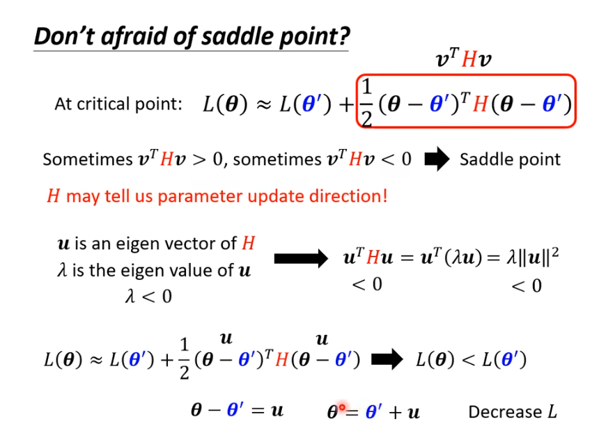
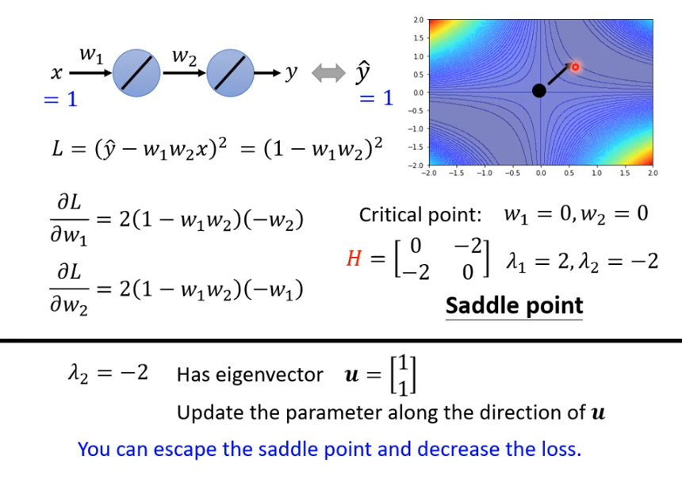
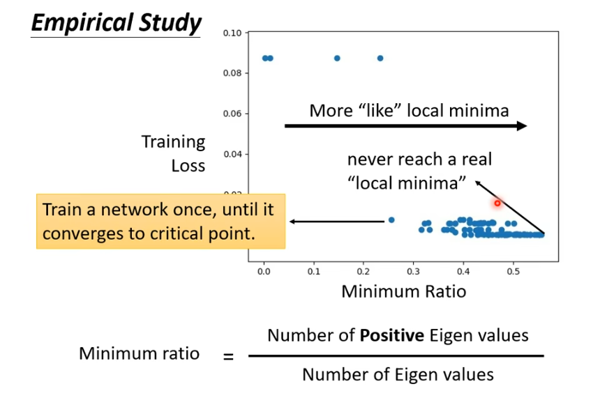

# Optimization Failure Cause

1. Local Minima
2. Saddle Point (鞍点)

上面的两种情况统称为`Critical Point`。

# How to tell between Local Minima and Saddle Point

我们可以用泰勒展开式来得到 $Loss(\theta)$ 近似的式子：

$$L(\theta) \approx L(\theta') + (\theta - \theta')^T g + \frac{1}{2} (\theta - \theta')H(\theta - \theta')$$
**Gradient** $g$ is a *vector*
$$g=\nabla L(\theta') \ \ \ g_i = \frac{\partial L(\theta')}{\partial \theta'}$$
**Hessian** $H$ is a *matrix*

$$H_{ij} = \frac{\partial ^2}{\partial \theta_i \partial \theta_j} L(\theta')$$
当我们遇到 `Critical Point` 时，$(\theta - \theta')^T g$ 为0，所以我们需要使用 $\frac{1}{2} (\theta - \theta')H(\theta - \theta')$ 来判断 $\theta = \theta'$ 附近的变化趋势。

$H$ 是一个矩阵，令 $v = (\theta - \theta')$ :

1. 对于所有的 $v$ ，如果 $v^THv > 0$ ，则 $\theta = \theta'$ 为Local Minima
2. 对于所有的 $v$ ，如果 $v^THv < 0$ ，则 $\theta = \theta'$ 为Local Maxima
3. 对于所有的 $v$ ，如果有的 $v^THv > 0$，有的 $v^THv < 0$ ，则 $\theta = \theta'$ 为Saddle Point

简化方法：

1. = 如果 $H$ 是一个正定矩阵(Positive Definite Matrix) = 所有的特征值(Eigen Value)都为正的。
2. = 如果 $H$ 是一个负定矩阵(Negative Definite Matrix) = 所有的特征值(Eigen Value)都为负的。
3. = 特征值(Eigen Value)有正有负。

> **特征值求法**：
> 求 $n$ 阶矩阵 $A$ 的特征值的基本方法:
> 根据定义可改写为关系式 $(\lambda E－A)x= 0$，其中 $E$ 为单位矩阵。要求向量 $x$ 具有非零解，即求齐次线性方程组 $(\lambda E－A)= 0$ 有非零解的值 $\lambda$ 。即要求行列式 $det(\lambda E－A）= 0$。解此行列式获得的 $\lambda$ 值即为矩阵 $A$ 的特征值。将此值回代入原式求得相应的 $x$ ，即为输入这个行列式的特征向量。
> 
> **特征多项式**：
> $$Ax=mx$$

(但是，上面的方法在实际中很少使用，因为上面的方法运算量非常大...)

# Saddle Point vs. Local Minima

> 在三维空间中没有路可以走，说不定在更高维的空间中就有路可以走了。

如果在二维空间中遇到了Local Minima，说不定在更高维的空间中它就是Saddle Point，这就是为什么很多模型的维数都非常高。

在实际的训练中，我们很难遇见Local Minima.