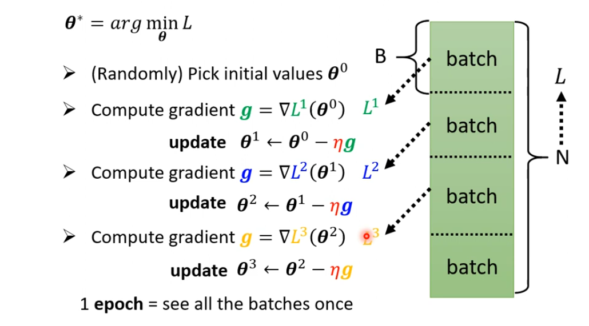

# What is Batch?

## Small Batch v.s. Large Batch

但是实际上，Batch Size在一定的范围内(1~10000)，并不会对训练的时间带来很大的影响，因为GPU拥有并行运算的能力。

**但是，当Batch Size较小的时候，Update的次数也会增多，所以总时间会较大。**

**反直觉的是，当Batch Size较大的时候，模型的质量反而会下降。**

## Why Smaller Batch is Better?

**小一点的Batch Size可以减少遇到局部最优解的可能性。**

**同时小的Batch Size可以提升模型测试时的准确率，即减小了Overfitting的可能性。**

## Summary

|                                      | Small  | Large                |
| ------------------------------------ | ------ | -------------------- |
| Speed for one update (no parallel)   | Faster | Slower               |
| Speed for one update (with parallel) | Same   | Same (not too large) |
| Time for one epoch                   | Slower | Faster               |
| Grdient                              | Noisy  | Stable               |
| Optimization                         | Better | Worse                |
| Generalization                       | Better | Worse                |
# Momentum

如果我们将训练的过程比作将参数的巨石推到最低点，在现实世界中由于惯性的存在，我们的巨石不会轻易地被Local Minima卡住。我们能否在训练的过程中也运用这种方法呢？

