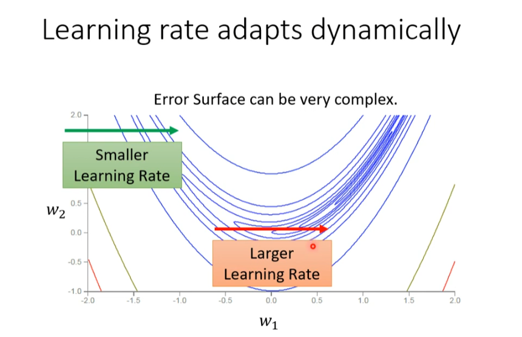
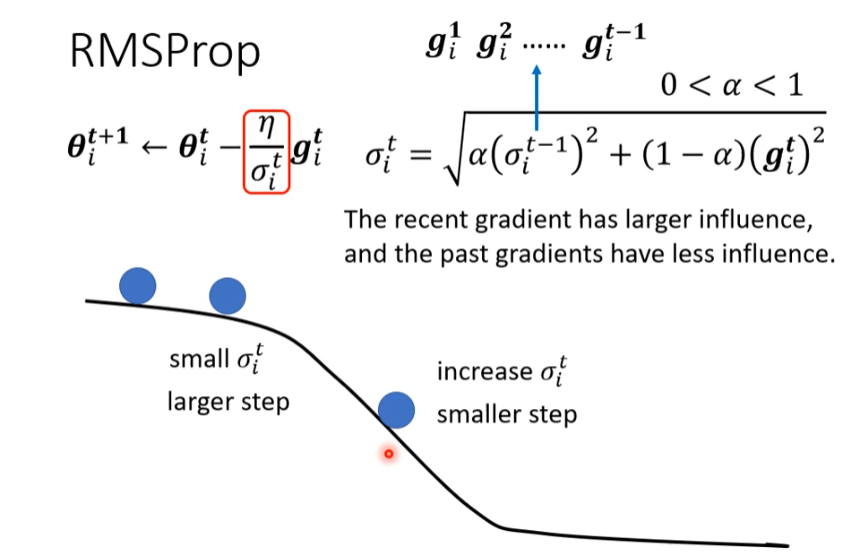
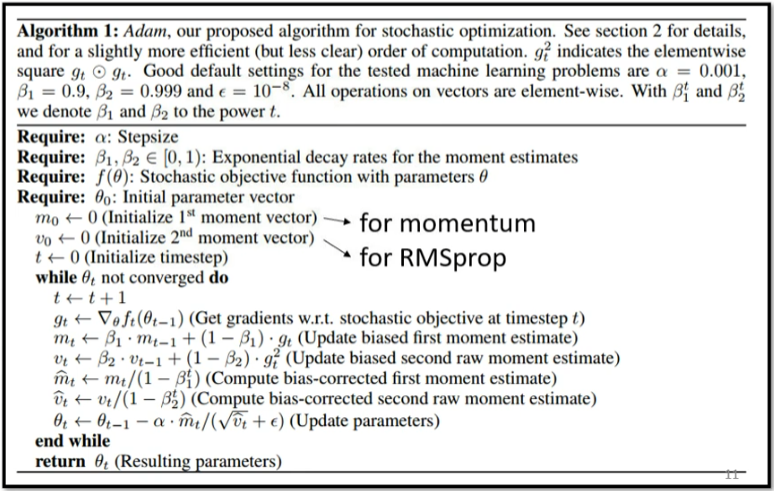
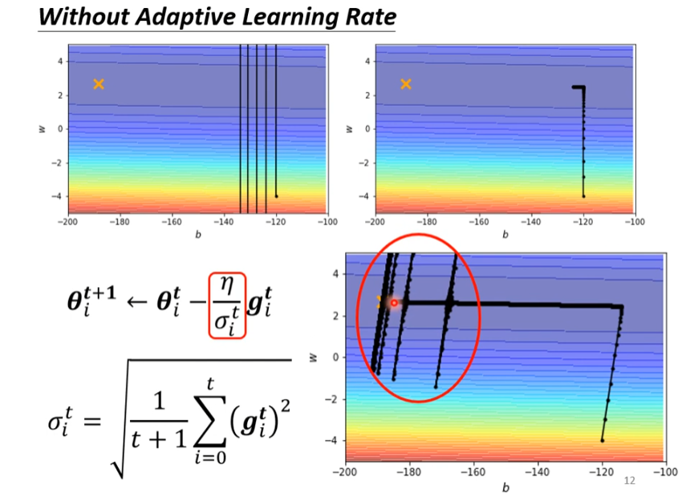
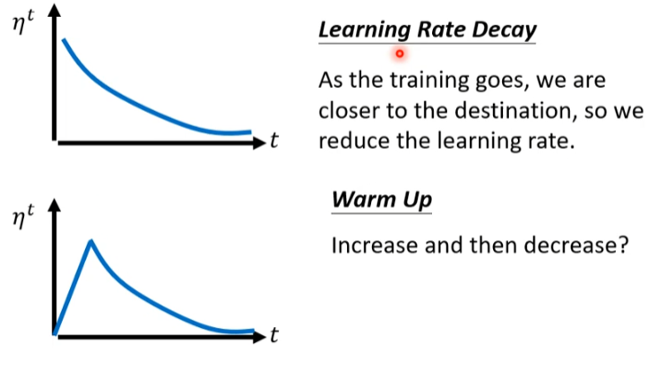

# Training stuck $\neq$ Small Gradient

在我们的日常训练模型中，走到Critical Point其实是一个相当难的过程。

固定学习速率的Gradient Descent很难满足更加复杂Error Surface。

# Different Parameters Needs Different Learning Rate

## Root Mean Square

$$\theta^1_i \leftarrow \theta^0_i - \frac{\eta}{\sigma^0_i}g^0_i \quad\sigma^0_i = \sqrt{(g^0_i)^2} = |g^0_i|$$
$$\theta^2_i \leftarrow \theta^1_i - \frac{\eta}{\sigma^1_i}g^1_i \quad \sigma^1_i = \sqrt{\frac{1}{2}[(g^0_i)^2+(g^1_i)^2]}$$
$$\theta^3_i \leftarrow \theta^2_i - \frac{\eta}{\sigma^2_i}g^2_i \quad\sigma^2_i = \sqrt{\frac{1}{3}[(g^0_i)^2+(g^1_i)^2+(g^2_i)^2]}$$
$$\vdots$$
$$\theta_{i}^{t+1}\leftarrow\theta_{i}^{t}-\frac{\eta}{\sigma_{i}^{t}}g_{i}^{t}\quad\sigma_{i}^{t}=\sqrt{\frac{1}{t+1}\sum_{i=0}^{t}\left(g_{i}^{t}\right)^{2}}$$
这种方法常用在`Adagrad`中，但是当Error Surface非常复杂的时候，我们希望Learning Rate可以自动调整。

## RMSProp

$$\theta^1_i \leftarrow \theta^0_i - \frac{\eta}{\sigma^0_i}g^0_i \quad\sigma^0_i = \sqrt{(g^0_i)^2} = |g^0_i|$$
$$\theta^2_i \leftarrow \theta^1_i - \frac{\eta}{\sigma^1_i}g^1_i \quad \sigma^1_i = \sqrt{\alpha(\sigma^0_i)^2+(1-\alpha)(g^1_i)^2},0 < \alpha < 1$$
$$\theta^3_i \leftarrow \theta^2_i - \frac{\eta}{\sigma^2_i}g^2_i \quad \sigma^2_i = \sqrt{\alpha(\sigma^1_i)^2+(1-\alpha)(g^2_i)^2},0 < \alpha < 1$$
$$\vdots$$
$$\theta^{t+1}_i \leftarrow \theta^t_i - \frac{\eta}{\sigma^2_i}g^t_i \quad \sigma^t_i = \sqrt{\alpha(\sigma^{t-1}_i)^2+(1-\alpha)(g^t_i)^2},0 < \alpha < 1$$

## Adam: RMSProp + Momentum

# Learning Rate Scheduling

当我们训练的时候，随着Loss的下降，由于之前的梯度变化方向的累计，会影响到之后的Loss变化方向。

所以我们需要使Learning Rate随时间变化。

## Learning Rate Decay

As the training goes ,we are closer to the destination, so we reduce the learning rate.

## Warm Up
Increase and then decrease?

**Radam**

# Summary Of Optimization

## (Vanilla) Gradient Descent

$$\theta_i^{t+1}\leftarrow\theta_i^t-\eta\boldsymbol{g}_i^t$$

## Various Improvements

$$\theta_i^{t+1}\leftarrow\theta_i^t-\frac{\eta^t}{\sigma_i^t}\boldsymbol{m}_i^t$$
$m$: weighted sum of the previous gradients (Consider direction)

$\sigma$: root mean square of the gradients (only magnitude)

$\eta$: Learning rate scheduling

