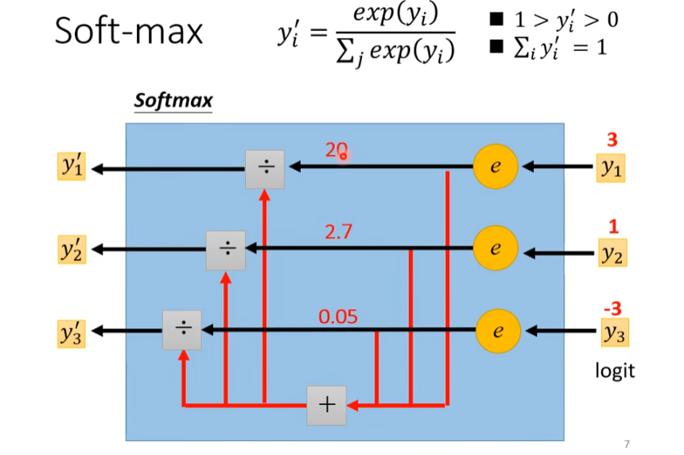
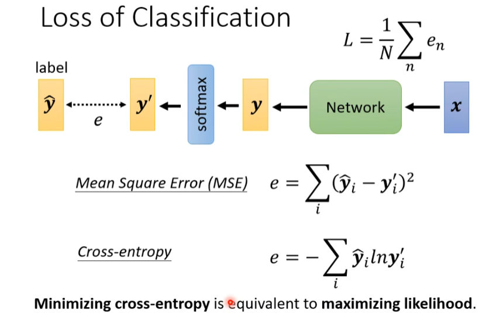
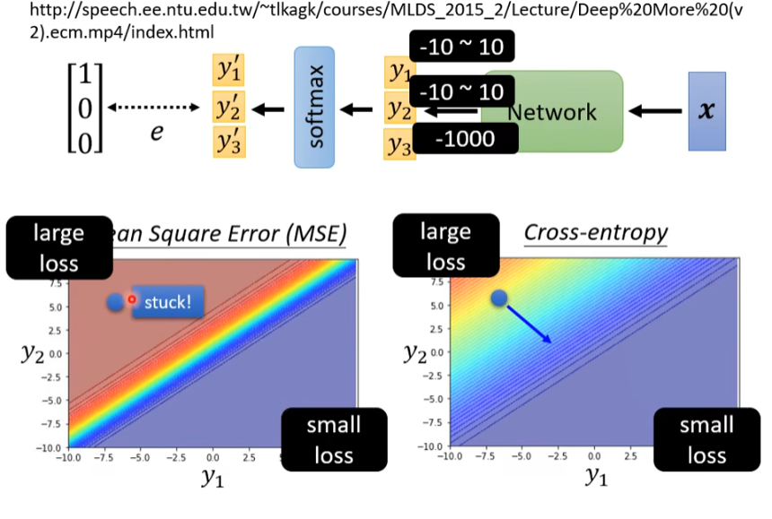

Classification or regression?

Using one-hot vector to represent Class.

## Regression

$$\hat{y} \leftrightarrow y = b + \mathbf{c^T} \sigma (\mathbf{b} + W \mathbf{x})$$
## Classification
$$y = b' + W' \sigma (\mathbf{b} + W \mathbf{x})$$
$$\hat{y} \leftrightarrow y' = softmax(y)$$
$$y' = \frac{exp(y_i)}{\sum_j exp(y_i)}$$

但是`Cross-entropy`相较于`Mean Square Error`更加适用于Classification。

Changing the loss function can change the difficulty of optimization.